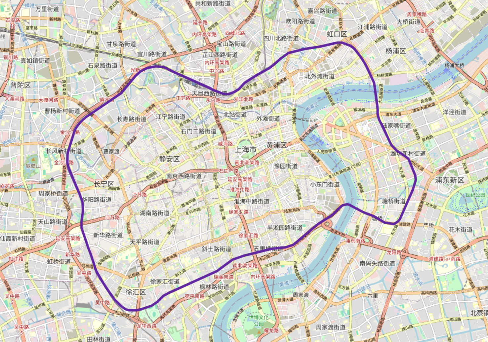
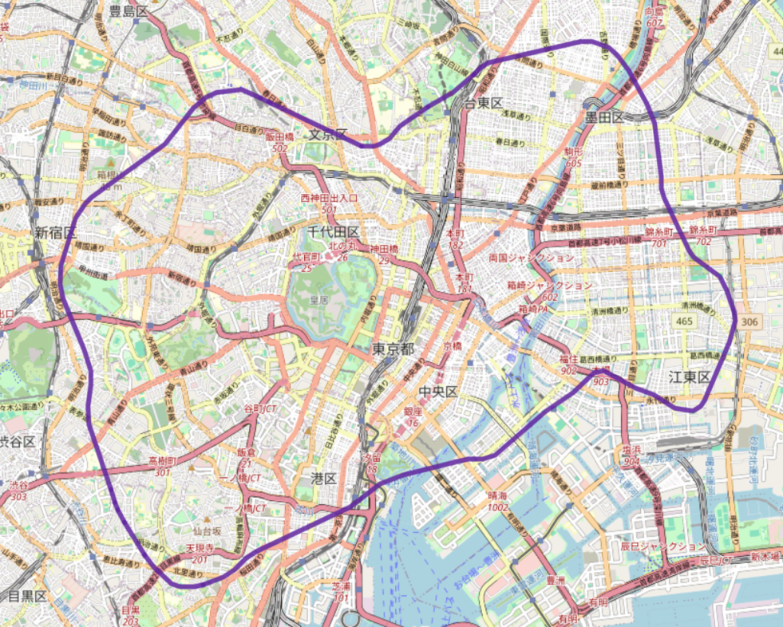

<div align=center>

</div>


<h1 align="center">
  Metro Drift · MetroDrifter
</h1>
<p align="center">
  <a href="./README_EN.md">English</a> ·
  <a href="./README_JP.md">日本語</a>
</p>
<p align="center">
  For rail enthusiasts
</p>

A web map app for rail fans: built on **OpenStreetMap**, it lets you search metro lines from around the world and scale them to any location on the globe—so you can compare the size and shape of different cities’ metro networks at a glance.

**Shanghai Metro Line 4:**



**Shanghai Metro Line 4 “drifted” to Tokyo:**



## Try it online

https://metro-drifter.vercel.app/

## Features

- **Search** — Browse metro lines by country/region from local data.
- **Select lines** — Pick a line and view it on the map.
- **Data** — Thousands of metro lines across 36 countries.

## Run locally

```bash
npm install
npm run dev
```

### (Optional) Update metro line data

The repo already includes metro data for all supported countries. To refresh it:

```bash
npm run download-data
```

This fetches line lists and geometry from the Overpass API and writes metadata to `public/data/countries.json` and `public/data/lines/*.json`, and geometry to `public/data/geometry/*.json`.

To download data for specific countries only:

```bash
# After --, list country names; use quotes for multi-word names
npm run download-data -- Japan
npm run download-data -- "South Korea"
npm run download-data -- China "South Korea" France
```

## Data & attribution

- Map data © [OpenStreetMap](https://www.openstreetmap.org/copyright) contributors  
- Railway styling © [OpenRailwayMap](http://www.openrailwaymap.org/) (CC-BY-SA 2.0)
